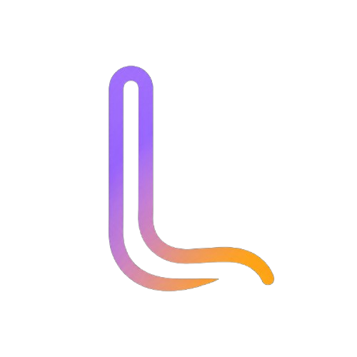
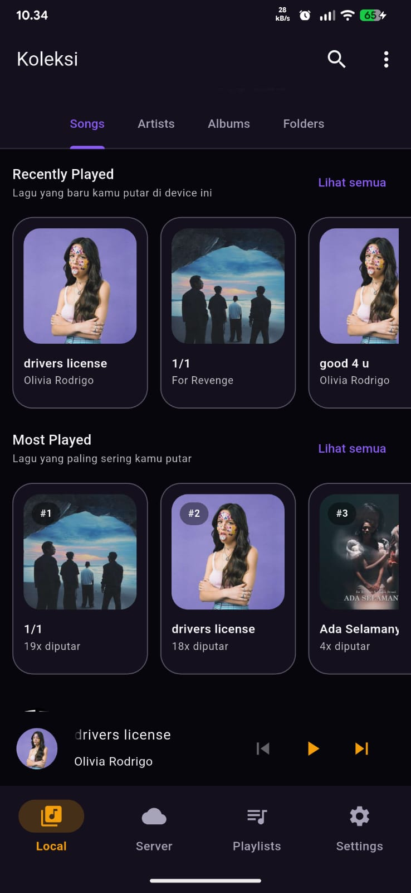
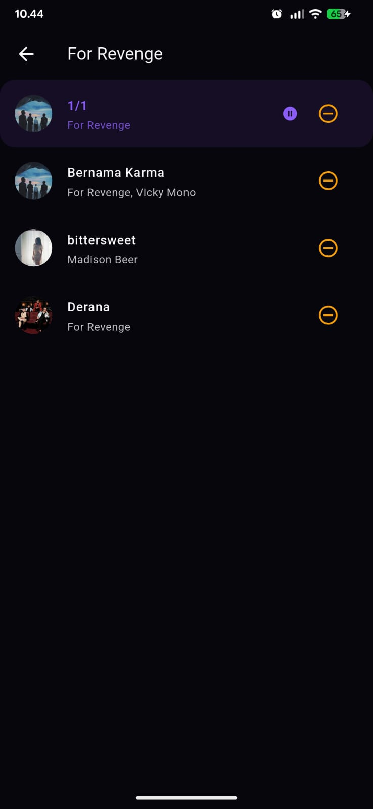
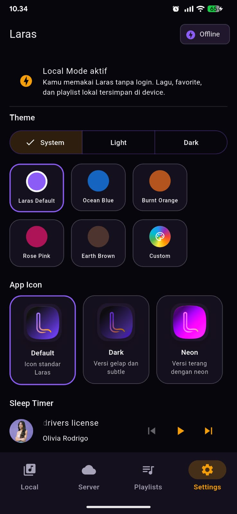
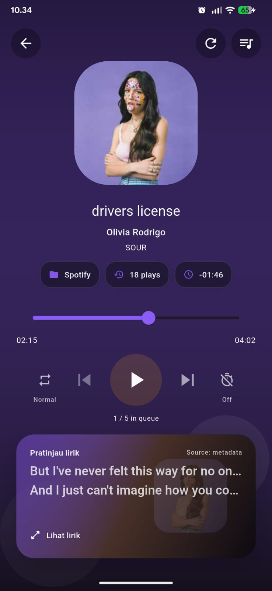
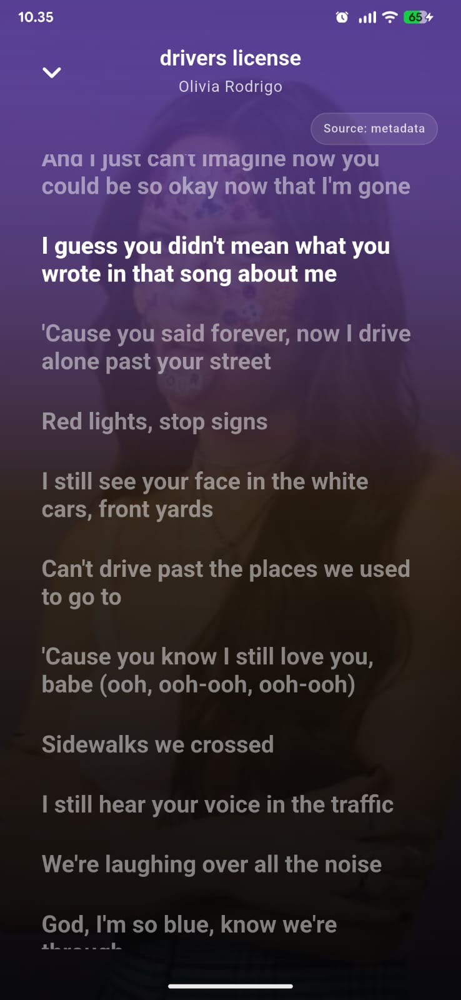

<p align="center">
  
</p>

<h1 align="center">Laras</h1>

<p align="center"><strong>Musikmu, aturanmu.</strong></p>
<p align="center"><strong>Your music, your rules.</strong></p>
<p align="center"><strong>あなたの音楽、あなたのルール。</strong></p>

<p align="center">
  <a href="https://github.com/IKHINtech/laras/releases/latest">
    
  </a>
  <a href="https://github.com/IKHINtech/laras">
    
  </a>
  <a href="https://laras.sarikhin.my.id">
    
  </a>
</p>

<p align="center">
  <a href="./README.id.md">Indonesia</a> |
  <a href="./README.en.md">English</a> |
  <a href="./README.ja.md">日本語</a>
</p>

---

Laras is an offline-first personal music player for people who want full control over their own collection without ads, forced login, or algorithmic recommendations.

Pilih bahasa dokumentasi:

- [Bahasa Indonesia](./README.id.md)
- [English](./README.en.md)
- [日本語](./README.ja.md)

## Highlights

- Offline-first local music player
- Android local library scanning
- Playlist, favorites, mini player, and now playing
- Sleep timer, theme, and custom app icon
- Optional self-hosted server mode

## Project Structure

```txt
laras/
├── apps/
│   └── mobile/          # Flutter Android app
├── services/
│   └── api/             # Go Fiber backend
├── docs/                # Documentation
├── infra/               # Deployment / docker config
└── README.md
```

## Screenshot

<p align="center">
  
  
  
  
  
</p>

## License

This project is released as open source.  
Please check the `LICENSE` file for details.

## Author

Built and maintained by **IKHINtech**.

- GitHub: [@IKHINtech](https://github.com/IKHINtech)
- Website: [laras.sarikhin.my.id](https://laras.sarikhin.my.id)
